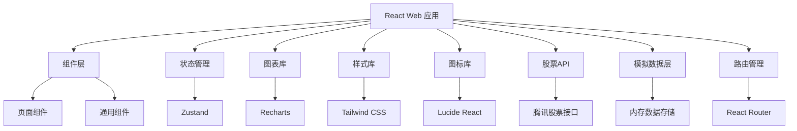
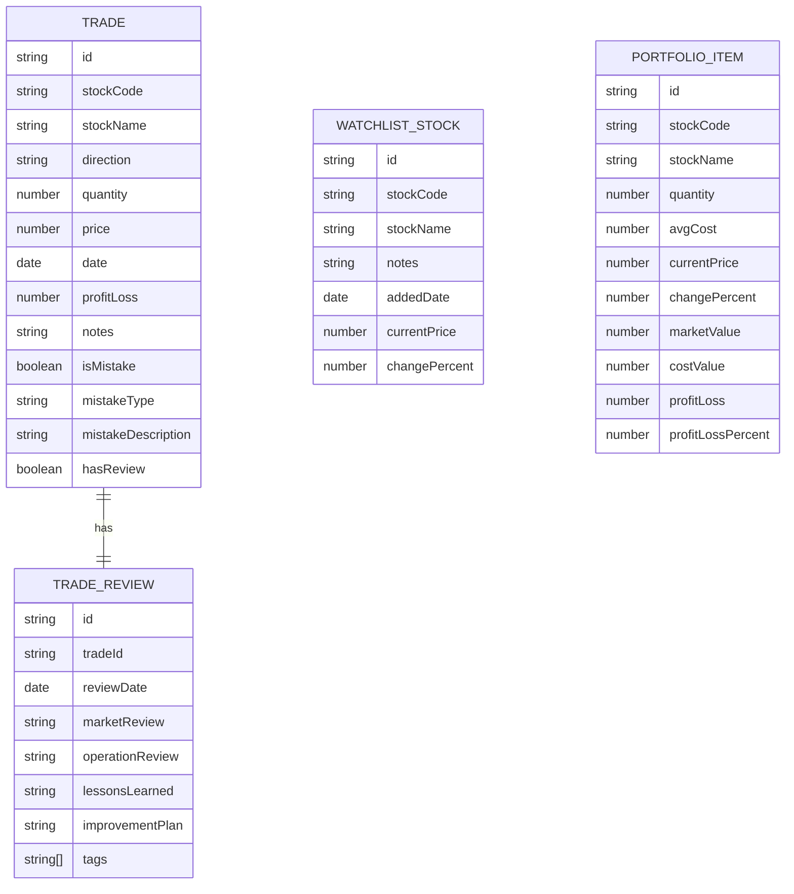

## 1. Architecture Design

本项目采用 React + TypeScript + Vite 构建现代 Web 应用，使用 Zustand 进行状态管理，Tailwind CSS 实现现代化 UI 设计，Recharts 用于数据可视化。数据暂时存储在内存中（使用模拟数据），通过腾讯股票接口获取实时股票数据。



## 2. Technology Description

* Frontend: React@18 + TypeScript + Tailwind CSS@3 + Vite
* State Management: Zustand
* Chart Library: Recharts
* Icon Library: Lucide React
* Routing: React Router v6
* Build Tool: Vite
* Stock Data API: Tencent Stock Interface (腾讯股票接口)

## 3. File Structure
```
/Users/tao/code/project
├── src/
│   ├── components/         # 通用组件
│   │   ├── Navbar.tsx      # 导航栏组件
│   │   ├── TradeForm.tsx   # 交易表单组件
│   │   └── ReviewForm.tsx  # 复盘表单组件
│   ├── pages/              # 页面组件
│   │   ├── TradeList.tsx       # 交易记录页
│   │   ├── Portfolio.tsx       # 当前持仓页
│   │   ├── Performance.tsx     # 业绩统计页
│   │   ├── TradeAnalysis.tsx   # 交易分析页
│   │   ├── Watchlist.tsx       # 观察池页
│   │   └── TradeReview.tsx     # 交易复盘页
│   ├── App.tsx             # 应用主组件
│   ├── main.tsx            # 应用入口
│   ├── index.css           # 全局样式
│   ├── types.ts            # TypeScript 类型定义
│   ├── store.ts            # Zustand 状态管理
│   ├── tauriApi.ts         # 模拟 API 层（内存数据）
│   └── stockApi.ts         # 腾讯股票 API 封装
├── scripts/
│   └── build.js            # 构建脚本
├── .trae/documents/        # 项目文档
├── index.html              # HTML 入口
├── package.json            # 项目依赖
├── tailwind.config.js      # Tailwind CSS 配置
├── tsconfig.json           # TypeScript 配置
└── vite.config.ts          # Vite 配置
```

## 4. Route Definitions

| Route        | Purpose |
| ------------ | ------- |
| /            | 交易记录页   |
| /portfolio   | 当前持仓页   |
| /performance | 业绩统计页   |
| /analysis    | 交易分析页   |
| /watchlist   | 观察池页    |
| /review      | 交易复盘页   |

## 5. Data Model

### 5.1 Data Model Definition



### 5.2 TypeScript Interface Definitions

```typescript
// 交易记录类型
interface Trade {
  id: string;
  stockCode: string;
  stockName: string;
  direction: 'buy' | 'sell';
  quantity: number;
  price: number;
  date: string;
  profitLoss?: number;
  notes?: string;
  isMistake?: boolean;
  mistakeType?: string;
  mistakeDescription?: string;
  hasReview?: boolean;
}

// 交易复盘类型
interface TradeReview {
  id: string;
  tradeId: string;
  reviewDate: string;
  marketReview: string;
  operationReview: string;
  lessonsLearned: string;
  improvementPlan: string;
  tags: string[];
}

// 观察股票类型
interface WatchlistStock {
  id: string;
  stockCode: string;
  stockName: string;
  notes?: string;
  addedDate: string;
  currentPrice?: number;
  changePercent?: number;
}

// 持仓项类型
interface PortfolioItem {
  id: string;
  stockCode: string;
  stockName: string;
  quantity: number;
  avgCost: number;
  currentPrice: number;
  changePercent?: number;
  marketValue: number;
  costValue: number;
  profitLoss: number;
  profitLossPercent: number;
}

// 统计数据类型
interface PerformanceStats {
  totalTrades: number;
  winningTrades: number;
  losingTrades: number;
  winRate: number;
  totalProfitLoss: number;
  avgProfit: number;
  totalReturn: number;
  bestTrade: number;
  worstTrade: number;
  monthlyReturns: Record<string, number>;
  yearlyReturns: Record<string, number>;
}

// 交易分析类型
interface MistakeAnalysis {
  totalMistakes: number;
  mistakesByType: Record<string, number>;
  mistakeImpact: Record<string, number>;
}

// 股票行情数据类型
interface StockQuote {
  code: string;
  name: string;
  price: number;
  change: number;
  changePercent: number;
  open: number;
  high: number;
  low: number;
  close: number;
  volume: number;
  amount: number;
}
```

## 6. API Layer

### 6.1 腾讯股票 API (stockApi.ts)

```typescript
// 获取多只股票实时行情
async function getStockQuotes(stockCodes: string[]): Promise<StockQuote[]>;

// 获取单只股票实时价格
async function getStockPrice(stockCode: string): Promise<number>;

// 腾讯股票 API 特性
// - 支持查询沪市(sh)和深市(sz)股票
// - 返回实时价格、涨跌幅、成交量等信息
// - 实现 30 秒缓存机制，避免频繁请求
// - 提供备用数据机制，API 失败时使用模拟数据
```

### 6.2 模拟数据 API (tauriApi.ts)

```typescript
// 交易记录相关
async function getTrades(): Promise<Trade[]>;
async function createTrade(trade: Omit<Trade, 'id'>): Promise<Trade>;
async function updateTrade(id: string, trade: Partial<Trade>): Promise<Trade>;
async function deleteTrade(id: string): Promise<void>;

// 复盘相关
async function getTradesWithReviews(): Promise<Array<Trade & { review?: TradeReview }>>;
async function createTradeReview(review: Omit<TradeReview, 'id'>): Promise<TradeReview>;
async function updateTradeReview(id: string, review: Partial<TradeReview>): Promise<TradeReview>;

// 观察池相关
async function getWatchlist(): Promise<WatchlistStock[]>;
async function addWatchlistStock(stock: Omit<WatchlistStock, 'id'>): Promise<WatchlistStock>;
async function removeWatchlistStock(id: string): Promise<void>;

// 统计分析相关
async function getPerformanceStats(): Promise<PerformanceStats>;
async function getMistakeAnalysis(): Promise<MistakeAnalysis>;

// 持仓相关
async function getPortfolio(): Promise<PortfolioItem[]>;
async function calculatePortfolio(): Promise<PortfolioItem[]>;

// 刷新股票数据
async function refreshStockPrices(): Promise<void>;
```

### 6.3 持仓计算逻辑

```typescript
// 计算当前持仓
function calculatePortfolio(): PortfolioItem[] {
  // 1. 按股票代码聚合所有交易
  // 2. 计算每只股票的持仓数量和平均成本
  // 3. 过滤掉持仓为 0 的股票
  // 4. 获取实时股价计算市值和盈亏
  // 5. 返回持仓列表
}
```

## 7. State Management (Zustand)

### 7.1 Store Structure

```typescript
interface AppState {
  // 数据状态
  trades: Trade[];
  portfolio: PortfolioItem[];
  watchlist: WatchlistStock[];
  performanceStats: PerformanceStats | null;
  mistakeAnalysis: MistakeAnalysis | null;
  tradesWithReviews: Array<Trade & { review?: TradeReview }>;
  isLoading: boolean;

  // 数据获取方法
  fetchTrades: () => Promise<void>;
  fetchPortfolio: () => Promise<void>;
  fetchWatchlist: () => Promise<void>;
  fetchPerformanceStats: () => Promise<void>;
  fetchMistakeAnalysis: () => Promise<void>;
  fetchTradesWithReviews: () => Promise<void>;

  // 交易管理
  addTrade: (trade: Omit<Trade, 'id'>) => Promise<void>;
  updateTrade: (id: string, trade: Partial<Trade>) => Promise<void>;
  deleteTrade: (id: string) => Promise<void>;

  // 复盘管理
  addReview: (review: Omit<TradeReview, 'id'>) => Promise<void>;
  updateReview: (id: string, review: Partial<TradeReview>) => Promise<void>;

  // 观察池管理
  addWatchlistStock: (stock: Omit<WatchlistStock, 'id'>) => Promise<void>;
  removeWatchlistStock: (id: string) => Promise<void>;

  // 刷新数据
  refreshStockPrices: () => Promise<void>;
}
```

## 8. UI/UX 设计特点

### 8.1 现代化视觉设计
- **玻璃拟态效果**：半透明卡片、模糊背景、渐变边框
- **深色主题**：深蓝色渐变背景 (#0f172a → #1e293b)
- **渐变色系统**：
  - 主色调：#0ea5e9 (青色)
  - 成功色：#22c55e (绿色)
  - 危险色：#ef4444 (红色)
- **交互动画**：渐入效果、滑动动画、悬停过渡

### 8.2 自动刷新机制
- **当前持仓页**：每 10 秒自动刷新股票实时价格
- **观察池页**：每 10 秒自动刷新股票实时价格
- **缓存策略**：30 秒缓存，避免频繁请求
- **优雅降级**：API 失败时使用备用数据

## 9. Build & Deployment

### 9.1 Scripts

```json
{
  "dev": "vite",                    // 开发模式
  "build": "tsc && vite build",     // 类型检查 + 构建
  "preview": "vite preview",        // 预览构建
  "package": "node scripts/build.js" // 完整打包流程
}
```

### 9.2 Build Process

```bash
# 1. 清理旧构建文件
# 2. TypeScript 类型检查
# 3. Vite 生产构建
# 4. 生成构建说明文档
# 5. 统计输出文件

# 输出：dist/ 目录
```

### 9.3 Deployment

构建产物可部署到任意静态文件服务器：
- GitHub Pages
- Vercel
- Netlify
- Nginx
- 或直接使用 `npx serve dist` 本地预览
