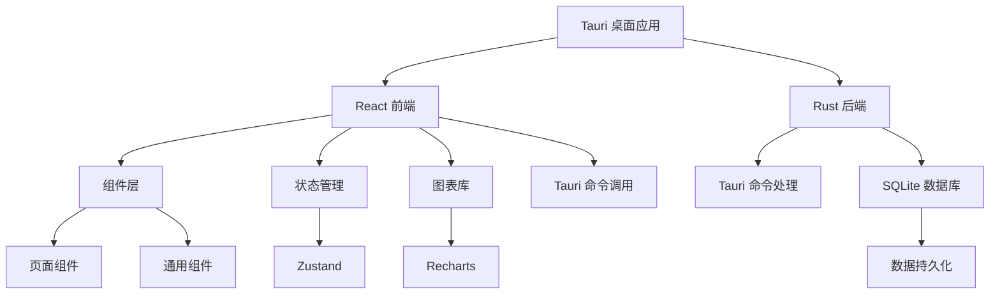
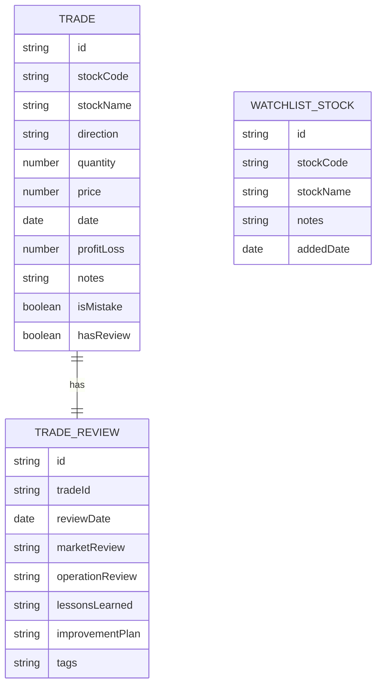

## 1. Architecture Design

本项目采用 Tauri 框架构建桌面应用，前端使用 React + TypeScript + Vite，后端使用 Rust，数据持久化使用 SQLite 数据库。



## 2. Technology Description

* Frontend: React\@18 + TypeScript + tailwindcss\@3 + vite

* Framework: Tauri\@2

* Backend: Rust

* Database: SQLite (rusqlite)

* 图表库: Recharts

* 状态管理: Zustand

* 图标库: Lucide React

## 3. Route Definitions

| Route        | Purpose |
| ------------ | ------- |
| /            | 交易记录页   |
| /performance | 业绩统计页   |
| /analysis    | 交易失误分析页 |
| /watchlist   | 观察池页    |
| /review      | 交易复盘页   |

## 4. Data Model

### 4.1 Data Model Definition



### 4.2 TypeScript Interface Definitions

```typescript
// 交易记录类型
interface Trade {
  id: string;
  stockCode: string;
  stockName: string;
  direction: 'buy' | 'sell';
  quantity: number;
  price: number;
  date: string;
  profitLoss?: number;
  notes?: string;
  isMistake?: boolean;
  mistakeType?: string;
  mistakeDescription?: string;
  hasReview?: boolean;
}

// 交易复盘类型
interface TradeReview {
  id: string;
  tradeId: string;
  reviewDate: string;
  marketReview: string;
  operationReview: string;
  lessonsLearned: string;
  improvementPlan: string;
  tags: string[];
}

// 观察股票类型
interface WatchlistStock {
  id: string;
  stockCode: string;
  stockName: string;
  notes?: string;
  addedDate: string;
  currentPrice?: number;
  changePercent?: number;
}

// 统计数据类型
interface PerformanceStats {
  totalTrades: number;
  winRate: number;
  totalProfitLoss: number;
  totalReturn: number;
  monthlyReturns: Record<string, number>;
  yearlyReturns: Record<string, number>;
}

// 交易失误分析类型
interface MistakeAnalysis {
  totalMistakes: number;
  mistakesByType: Record<string, number>;
  mistakeImpact: Record<string, number>;
}
```

### 4.3 SQLite 数据库表结构

```sql
-- 交易记录表
CREATE TABLE trades (
    id TEXT PRIMARY KEY,
    stock_code TEXT NOT NULL,
    stock_name TEXT NOT NULL,
    direction TEXT NOT NULL CHECK (direction IN ('buy', 'sell')),
    quantity INTEGER NOT NULL,
    price REAL NOT NULL,
    date TEXT NOT NULL,
    profit_loss REAL,
    notes TEXT,
    is_mistake INTEGER DEFAULT 0,
    mistake_type TEXT,
    mistake_description TEXT,
    has_review INTEGER DEFAULT 0,
    created_at TEXT DEFAULT CURRENT_TIMESTAMP,
    updated_at TEXT DEFAULT CURRENT_TIMESTAMP
);

-- 交易复盘表
CREATE TABLE trade_reviews (
    id TEXT PRIMARY KEY,
    trade_id TEXT NOT NULL,
    review_date TEXT NOT NULL,
    market_review TEXT,
    operation_review TEXT,
    lessons_learned TEXT,
    improvement_plan TEXT,
    tags TEXT,
    created_at TEXT DEFAULT CURRENT_TIMESTAMP,
    updated_at TEXT DEFAULT CURRENT_TIMESTAMP,
    FOREIGN KEY (trade_id) REFERENCES trades(id) ON DELETE CASCADE
);

-- 观察股票表
CREATE TABLE watchlist_stocks (
    id TEXT PRIMARY KEY,
    stock_code TEXT NOT NULL,
    stock_name TEXT NOT NULL,
    notes TEXT,
    added_date TEXT NOT NULL,
    created_at TEXT DEFAULT CURRENT_TIMESTAMP,
    updated_at TEXT DEFAULT CURRENT_TIMESTAMP
);

-- 创建索引
CREATE INDEX idx_trades_date ON trades(date);
CREATE INDEX idx_trades_stock_code ON trades(stock_code);
CREATE INDEX idx_trade_reviews_trade_id ON trade_reviews(trade_id);
CREATE INDEX idx_watchlist_stocks_stock_code ON watchlist_stocks(stock_code);
```

## 5. Tauri 命令 API 定义

### 5.1 交易记录相关命令

```typescript
// 创建交易
async function create_trade(trade: Omit<Trade, 'id' | 'createdAt' | 'updatedAt'>): Promise<Trade>;

// 获取所有交易
async function get_trades(): Promise<Trade[]>;

// 更新交易
async function update_trade(id: string, trade: Partial<Trade>): Promise<Trade>;

// 删除交易
async function delete_trade(id: string): Promise<void>;
```

### 5.2 交易复盘相关命令

```typescript
// 创建复盘
async function create_trade_review(review: Omit<TradeReview, 'id' | 'createdAt' | 'updatedAt'>): Promise<TradeReview>;

// 获取交易的复盘
async function get_trade_review(tradeId: string): Promise<TradeReview | null>;

// 获取所有带复盘的交易
async function get_trades_with_reviews(): Promise<Array<Trade & { review?: TradeReview }>>;

// 更新复盘
async function update_trade_review(id: string, review: Partial<TradeReview>): Promise<TradeReview>;
```

### 5.3 观察股票相关命令

```typescript
// 添加观察股票
async function add_watchlist_stock(stock: Omit<WatchlistStock, 'id' | 'createdAt' | 'updatedAt'>): Promise<WatchlistStock>;

// 获取观察列表
async function get_watchlist(): Promise<WatchlistStock[]>;

// 删除观察股票
async function remove_watchlist_stock(id: string): Promise<void>;
```

### 5.4 统计分析相关命令

```typescript
// 获取业绩统计
async function get_performance_stats(startDate?: string, endDate?: string): Promise<PerformanceStats>;

// 获取失误分析
async function get_mistake_analysis(): Promise<MistakeAnalysis>;
```

