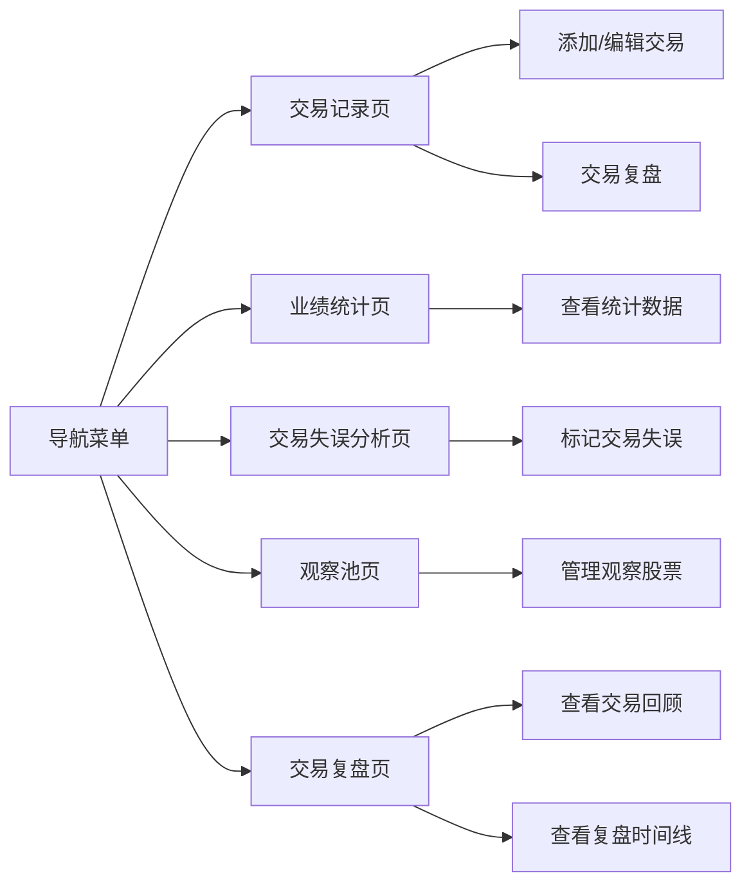

## 1. Product Overview
投资交易日记系统，帮助A股投资者记录交易、分析业绩、反思失误并跟踪关注股票。
- 核心用途：记录交易历史、分析投资绩效、总结交易教训、管理观察股票池
- 目标用户：A股个人投资者
- 应用特点：本地桌面应用，无需登录，点开即用，数据安全存储在本地

## 2. Core Features

### 2.2 Feature Module
1. **交易记录页**：交易列表、添加交易、编辑/删除交易
2. **业绩统计页**：月度/年度业绩仪表板、收益率统计、资产变化图表
3. **交易失误分析页**：交易失误分类、原因分析、改进建议统计
4. **观察池页**：股票列表、添加/移除股票、备注管理
5. **交易复盘页**：交易记录回顾、历史复盘查看、按维度筛选复盘

### 2.3 Page Details
| Page Name | Module Name | Feature description |
|-----------|-------------|---------------------|
| 交易记录页 | 交易列表 | 显示所有交易记录，支持按日期、股票筛选 |
| 交易记录页 | 交易表单 | 添加或编辑交易，包括股票代码、名称、买卖方向、数量、价格、日期、备注 |
| 交易记录页 | 交易复盘 | 对单笔交易进行复盘，填写复盘内容、心得体会 |
| 业绩统计页 | 业绩概览 | 显示总收益率、年度收益率、月度收益率等关键指标 |
| 业绩统计页 | 图表展示 | 使用图表展示资产变化趋势、月度/年度收益率对比 |
| 交易失误分析页 | 失误统计 | 按失误类型分类统计，显示各类失误的次数和影响金额 |
| 交易失误分析页 | 失误列表 | 显示标记为失误的交易记录，支持查看详情和编辑 |
| 观察池页 | 股票列表 | 显示关注的股票，支持添加、删除、备注编辑 |
| 观察池页 | 股票信息 | 显示股票基本信息、当前价格、涨跌幅（模拟数据） |
| 交易复盘页 | 交易回顾列表 | 显示所有带复盘的交易记录，支持按时间、股票、盈亏筛选 |
| 交易复盘页 | 复盘详情查看 | 查看单笔交易的完整复盘内容 |
| 交易复盘页 | 复盘时间线 | 以时间线形式展示交易复盘历史 |

## 3. Core Process
用户打开应用后可在交易记录页添加、查看、编辑交易和进行复盘；在业绩统计页查看投资绩效；在交易失误分析页反思交易失误；在观察池页管理关注的股票；在交易复盘页回顾历史交易和查看复盘记录。

## 4. User Interface Design
### 4.1 Design Style
- 主色调：深蓝色 (#1e3a5f) 和青色 (#00b4d8) 组合，体现专业金融感
- 次要颜色：绿色 (#06d6a0) 表示盈利，红色 (#ef476f) 表示亏损
- 按钮风格：圆角矩形，轻微阴影，悬停有微妙放大效果
- 字体：使用 'Inter' 作为主字体，'Roboto Mono' 用于数字显示
- 布局风格：卡片式布局，清晰的信息层级，适当留白
- 图标风格：简约线性图标，使用 Lucide React 图标库

### 4.2 Page Design Overview
| Page Name | Module Name | UI Elements |
|-----------|-------------|-------------|
| 交易记录页 | 导航栏 | 固定顶部，深色背景，五个主要导航项 |
| 交易记录页 | 交易卡片 | 白色卡片，显示股票名称、代码、交易方向、价格、日期、盈亏金额、复盘状态标识 |
| 交易记录页 | 复盘表单 | 弹窗形式，包含交易回顾、经验教训、改进计划等字段 |
| 业绩统计页 | 指标卡片 | 带渐变背景的统计卡片，突出显示关键数据 |
| 业绩统计页 | 图表区域 | 使用 Recharts 库绘制折线图和柱状图 |
| 交易失误分析页 | 失误统计图表 | 饼图展示失误类型分布 |
| 观察池页 | 股票卡片 | 网格布局，显示股票信息和涨跌幅标识 |
| 交易复盘页 | 筛选栏 | 按时间范围、股票、盈亏状态筛选复盘记录 |
| 交易复盘页 | 复盘卡片列表 | 显示交易基本信息和复盘摘要，点击查看详情 |
| 交易复盘页 | 复盘详情弹窗 | 展示完整的复盘内容和交易信息 |
| 交易复盘页 | 复盘时间线 | 时间轴形式展示复盘历史，便于纵向对比 |

### 4.3 Responsiveness
桌面端优先设计，同时适配平板和移动设备。使用 Tailwind CSS 响应式工具类，确保在不同屏幕尺寸上都有良好的显示效果。

### 4.4 3D Scene Guidance
本项目暂不涉及3D场景。
