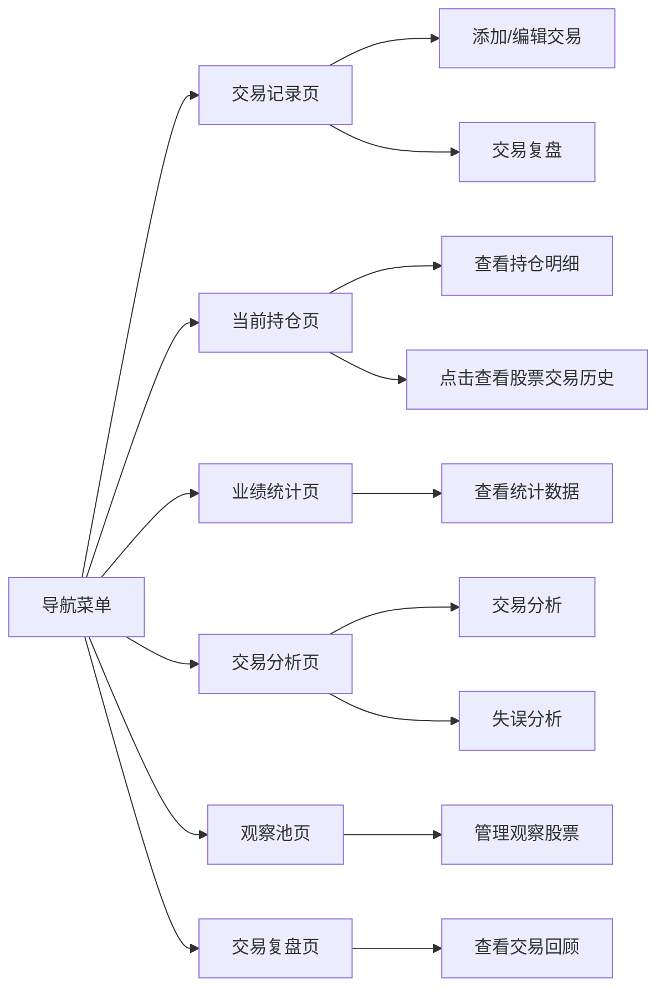

## 1. Product Overview
投资交易日记系统，帮助A股投资者记录交易、分析业绩、反思失误并跟踪关注股票。
- 核心用途：记录交易历史、分析投资绩效、跟踪当前持仓、总结交易教训、管理观察股票池
- 目标用户：A股个人投资者
- 应用特点：Web应用，数据暂时存储在内存中，提供实时股票数据查询（使用腾讯股票接口）

## 2. Core Features

### 2.2 Feature Module
1. **交易记录页**：交易列表、添加交易、编辑/删除交易、交易复盘
2. **当前持仓页**：持仓概览、实时市值/盈亏、持仓明细、点击查看股票交易历史、自动刷新数据
3. **业绩统计页**：月度/年度业绩仪表板、收益率统计、资产变化图表
4. **交易分析页**：综合分析交易表现、胜率统计、月度/个股盈亏、失误分析
5. **观察池页**：股票列表、添加/移除股票、备注管理、实时价格和涨跌幅、自动刷新数据
6. **交易复盘页**：交易记录回顾、历史复盘查看、按维度筛选复盘

### 2.3 Page Details
| Page Name | Module Name | Feature description |
|-----------|-------------|---------------------|
| 交易记录页 | 交易列表 | 显示所有交易记录，支持按日期、股票筛选 |
| 交易记录页 | 交易表单 | 添加或编辑交易，包括股票代码、名称、买卖方向、数量、价格、日期、备注、是否失误标记 |
| 交易记录页 | 交易复盘 | 对单笔交易进行复盘，填写复盘内容、心得体会 |
| 当前持仓页 | 持仓概览 | 显示总市值、总成本、浮动盈亏、总收益率 |
| 当前持仓页 | 持仓明细 | 显示各持仓股票的名称、数量、均价、现价、市值、盈亏、收益率、涨跌幅 |
| 当前持仓页 | 股票详情 | 点击持仓股票可查看该股票的完整交易历史和当前持仓统计 |
| 当前持仓页 | 自动刷新 | 每10秒自动刷新股票实时价格和持仓数据 |
| 当前持仓页 | 持仓图表 | 饼图展示持仓市值分布 |
| 业绩统计页 | 业绩概览 | 显示总交易次数、胜率、总盈亏、平均盈亏、最佳/最差交易等关键指标 |
| 业绩统计页 | 图表展示 | 使用图表展示月度收益率、个股盈亏分布 |
| 交易分析页 | 综合分析 | 展示交易统计、胜率分析、盈亏分布、失误分析等全面信息 |
| 交易分析页 | 失误分析 | 按失误类型分类统计，显示各类失误的次数和影响金额 |
| 观察池页 | 股票列表 | 显示关注的股票，支持添加、删除、备注编辑 |
| 观察池页 | 股票信息 | 显示股票基本信息、当前价格、涨跌幅（使用腾讯股票接口实时数据） |
| 观察池页 | 自动刷新 | 每10秒自动刷新观察股票的实时价格 |
| 交易复盘页 | 交易回顾列表 | 显示所有带复盘的交易记录，支持按时间、股票、盈亏筛选 |
| 交易复盘页 | 复盘详情查看 | 查看单笔交易的完整复盘内容 |

## 3. Core Process
用户打开应用后可在交易记录页添加、查看、编辑交易和进行复盘；在当前持仓页查看实时持仓和盈亏；在业绩统计页查看投资绩效；在交易分析页进行全面的交易表现分析；在观察池页管理关注的股票；在交易复盘页回顾历史交易和查看复盘记录。

## 4. User Interface Design
### 4.1 Design Style
- 主色调：深蓝色 (#0f172a) 和青色 (#0ea5e9) 组合，体现专业金融感
- 次要颜色：绿色 (#22c55e) 表示盈利/上涨，红色 (#ef4444) 表示亏损/下跌
- 视觉效果：玻璃拟态设计，半透明卡片，模糊背景，渐变元素
- 动画效果：渐入动画、滑动动画、平滑过渡
- 按钮风格：圆角矩形，悬停有微妙效果
- 字体：使用 'Inter' 作为主字体，'JetBrains Mono' 用于数字显示
- 布局风格：卡片式布局，清晰的信息层级，适当留白
- 图标风格：简约线性图标，使用 Lucide React 图标库

### 4.2 Page Design Overview
| Page Name | Module Name | UI Elements |
|-----------|-------------|-------------|
| 交易记录页 | 导航栏 | 固定顶部，深色玻璃背景，六个主要导航项 |
| 交易记录页 | 交易卡片 | 玻璃拟态卡片，显示股票名称、代码、交易方向、价格、日期、盈亏金额、复盘状态标识 |
| 交易记录页 | 复盘表单 | 弹窗形式，包含交易回顾、经验教训、改进计划等字段 |
| 当前持仓页 | 统计卡片 | 四个玻璃拟态卡片，展示总市值、总成本、浮动盈亏、总收益率 |
| 当前持仓页 | 持仓图表 | 饼图展示各股票持仓市值占比 |
| 当前持仓页 | 持仓列表 | 可点击的股票卡片，显示完整持仓信息和实时涨跌幅 |
| 当前持仓页 | 详情弹窗 | 点击股票后展示该股票的完整交易历史和当前持仓统计 |
| 业绩统计页 | 指标卡片 | 玻璃拟态统计卡片，突出显示关键数据 |
| 业绩统计页 | 图表区域 | 使用 Recharts 库绘制柱状图展示月度收益率 |
| 交易分析页 | 综合分析 | 包含胜率统计、盈亏图表、失误分析的全面分析面板 |
| 交易分析页 | 失误统计图表 | 饼图展示失误类型分布 |
| 观察池页 | 股票卡片 | 网格布局的玻璃拟态卡片，显示股票信息和涨跌幅标识 |
| 交易复盘页 | 筛选栏 | 按时间范围、股票、盈亏状态筛选复盘记录 |
| 交易复盘页 | 复盘卡片列表 | 玻璃拟态卡片显示交易基本信息和复盘摘要，点击查看详情 |
| 交易复盘页 | 复盘详情弹窗 | 展示完整的复盘内容和交易信息 |

### 4.3 Responsiveness
桌面端优先设计，同时适配平板和移动设备。使用 Tailwind CSS 响应式工具类，确保在不同屏幕尺寸上都有良好的显示效果。

### 4.4 3D Scene Guidance
本项目暂不涉及3D场景。
